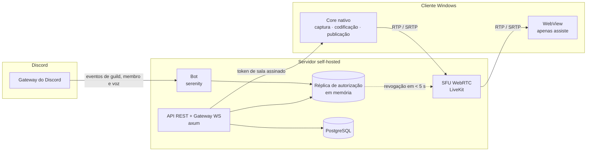
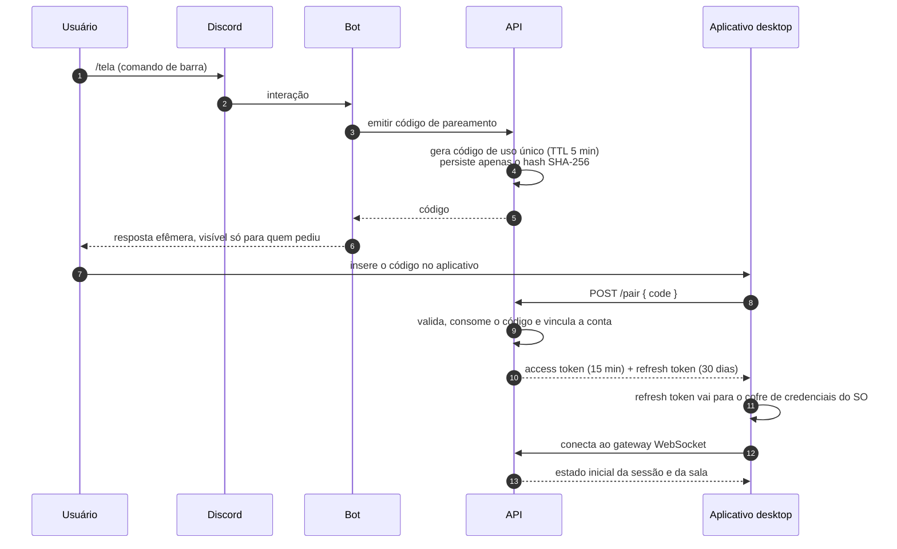
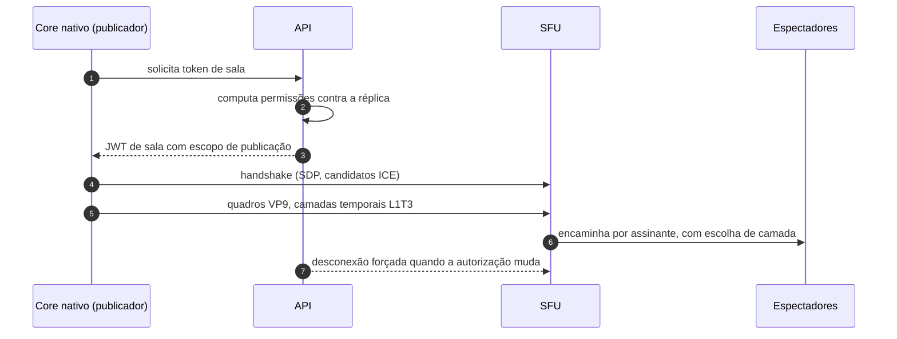

# ldktela

[](LICENSE)
[]()
[]()
[]()
[]()

Prova de conceito de um sistema distribuído de mídia em tempo real: captura nativa de tela,
codificação de vídeo e distribuição por um SFU WebRTC, com pareamento de sessão delegado a um
bot do Discord. Projeto experimental, pensado para execução self-hosted em rede controlada.

> **Sem afiliação com a Discord Inc.** Este é um projeto independente, de estudo, que usa as
> APIs públicas de bot do Discord como camada de identidade e autorização.

---

## Visão geral

O sistema resolve três problemas de engenharia que costumam aparecer juntos em aplicações de
mídia em tempo real, e que aqui foram atacados de forma explícita:

**1. Autenticação sem credencial própria.** Não há cadastro, senha nem diretório de usuários.
A identidade vem de uma conta do Discord já existente, e a ponte entre a conta e o aplicativo
é um código efêmero, no mesmo formato conceitual de um *device authorization flow*
([RFC 8628](https://datatracker.ietf.org/doc/html/rfc8628)): o dispositivo que quer ser
autorizado não recebe credencial alguma; ele apresenta um código de curta duração, emitido em
outro canal já autenticado.

**2. Autorização contínua, não só na porta.** Uma sessão de mídia dura horas. Verificar
permissão apenas na admissão deixa uma janela do tamanho da sessão inteira. Aqui, o estado de
autorização é replicado em memória a partir dos eventos do gateway e reavaliado continuamente:
quando o acesso de alguém é removido na origem, o participante é desconectado do SFU em menos
de 5 segundos, sem esperar a renovação de nenhum token.

**3. Latência e custo de codificação sob controle.** Captura, conversão de espaço de cor,
codificação e publicação acontecem em um core nativo em Rust, fora do runtime web. A escada de
qualidade do VP9 é **temporal** (`L1T3`), e não espacial, porque as camadas espaciais medidas
nesta topologia entregavam 0 quadro ou degradavam a taxa a ~11 fps; com camadas temporais, o
mesmo cenário sustenta 1080p a ~59,5 fps. O raciocínio e os números estão no
[ADR-0032](docs/adr/0032-a-escada-do-vp9-e-temporal.md).

---

## Arquitetura do sistema



### Fluxo de pareamento



### Fluxo de mídia



---

## Destaques de engenharia

### Pareamento por código efêmero

O aplicativo nunca manipula credenciais do Discord. O comando de barra emite um código de uso
único com validade de 5 minutos, entregue em resposta efêmera. Do lado do servidor, o código é
persistido apenas como hash SHA-256 — um vazamento da base não revela códigos utilizáveis.

A troca devolve um par de tokens: um *access token* JWT de 15 minutos e um *refresh token*
opaco e rotativo de 30 dias, gerenciado em família. Reúso de um token já rotacionado é tratado
como comprometimento e revoga a família inteira. O refresh token é guardado pelo core nativo no
cofre de credenciais do sistema operacional, nunca em armazenamento do navegador.

### Autorização derivada e reavaliada

O bot mantém em memória uma réplica de servidores, canais de voz, cargos e membros, construída
a partir do estado inicial e mantida por eventos incrementais. As decisões de admissão são
computadas contra essa réplica usando as constantes de permissão da própria biblioteca, nunca
bits escritos à mão.

A réplica falha fechada: se o gateway cair e a janela de carência passar, admissões novas são
recusadas em vez de liberadas por otimismo. O intent de conteúdo de mensagens **não** é usado —
o sistema não lê mensagens.

### Pipeline de captura e codificação

Captura nativa, conversão de espaço de cor e codificação VP9 acontecem no core em Rust; o
runtime web do cliente apenas assiste, e nunca adquire mídia. Isso remove o seletor e a barra
de controle impostos pelo motor web, e mantém o caminho de vídeo fora do laço de renderização
da interface.

O *preview* da própria tela é local, gerado a partir do mesmo buffer de captura e reduzido por
libyuv, em vez de trafegar pelo SFU: a própria tela nunca sai da máquina duas vezes.

### Latência, jitter e escolha de camada

O SFU encaminha por assinante, e cada espectador escolhe a camada temporal que sua rede
sustenta. Quem publica define resolução e taxa de quadros; quem assiste se adapta. Elementos de
vídeo são montados uma vez por *track* e nunca remontados por mudança de layout, porque
remontar derruba o decodificador e custa segundos de tela preta.

---

## Stack tecnológica

| Camada | Escolha |
|---|---|
| API, gateway WS, emissão de token | Rust · axum 0.8 · tokio |
| Persistência | PostgreSQL 16 · SQLx (consultas verificadas em tempo de compilação) |
| Integração com o Discord | serenity |
| SFU WebRTC | LiveKit (`v1.13.6`) |
| Core do cliente | Rust · SDK Rust do LiveKit · WASAPI (`windows`) · Tauri 2 |
| Interface do cliente | React 19 · TypeScript estrito · Vite · Tailwind · zustand |
| Empacotamento e deploy | Docker Compose · instalador MSI com atualização assinada |

Identificadores e comentários de código em inglês; documentação e interface em português do
Brasil.

---

## Pré-requisitos

**Servidor**

- Docker e Docker Compose
- Uma aplicação de bot no Discord, com os intents de **servidores**, **membros** e **estados de
  voz** habilitados
- Portas alcançáveis: API (padrão `8090`), sinalização do SFU (`7880`), TCP de mídia (`7881`) e
  UDP multiplexado de mídia (`7882/udp`)

**Cliente (para compilar)**

- Windows 10 ou 11
- Rust estável e Node.js 22
- O primeiro build baixa uma libwebrtc pré-compilada (~114 MB) e compila C++ por vários
  minutos; reserve alguns GB de disco

---

## Instalação self-hosted

```bash
git clone https://github.com/gbrlevi/ldktela
cd ldktela
cp docker/env.remote.example .env.remote
```

Preencha o `.env.remote`. As variáveis que exigem decisão:

| variável | o que é |
|---|---|
| `DISCORD_BOT_TOKEN` | token da sua aplicação de bot |
| `DISCORD_ALLOWED_GUILDS` | IDs dos servidores que esta instância atende, separados por vírgula; vazio atende todos |
| `JWT_SIGNING_KEY` | chave HMAC de ao menos 32 caracteres (`openssl rand -base64 48`) |
| `LIVEKIT_API_KEY` / `LIVEKIT_API_SECRET` | par gerado com `docker run --rm livekit/livekit-server:v1.13.6 generate-keys` |
| `LIVEKIT_NODE_IP` | IP público do host, anunciado nos candidatos ICE |
| `LIVEKIT_URL` / `PUBLIC_BASE_URL` | endereços públicos do SFU e da API |
| `API_PORT` | porta da API no host (padrão `8090`) |

Suba a infraestrutura:

```bash
just remote-up      # ou: docker compose --env-file .env.remote -f docker/compose.remote.yml up -d --build
just remote-logs
```

Gere o instalador apontando para a sua instância:

```bash
cp desktop/.env.production.example desktop/.env.production
# VITE_SERVER_ORIGIN=http://<seu-host>:8090
# LIVEKIT_PUBLIC_URL=ws://<seu-host>:7880
just build-app
```

O fluxo de release do GitHub funciona em um fork: defina `VITE_SERVER_ORIGIN` e
`LIVEKIT_PUBLIC_URL` nas variáveis do repositório e publique uma tag `vX.Y.Z`.

O guia completo de implantação, com verificação porta a porta, está em
[docs/deploy-oracle.md](docs/deploy-oracle.md).

### Sobre os binários publicados

Os instaladores anexados às releases deste repositório são compilados para uma instância
específica e atendem apenas os servidores declarados em `DISCORD_ALLOWED_GUILDS` daquela
instância. Fora dessa lista, o comando de pareamento responde informando a recusa. Para usar o
projeto, execute a sua própria instância — é para isso que o deploy é modular
([ADR-0035](docs/adr/0035-a-instancia-serve-servidores-nomeados.md)).

---

## Desenvolvimento

```bash
just dev      # PostgreSQL + SFU em Docker, servidor em modo watch
just app      # aplicativo em modo desenvolvimento
just check    # formatação, lint, consultas verificadas, testes e checagem de tipos
```

`just check` é o portão: formatação, `clippy` sem avisos, cache de consultas do SQLx conferido,
testes de Rust com PostgreSQL real via testcontainers, checagem de tipos do TypeScript, testes
de frontend e lint. Testes de integração não usam mocks de repositório.

As regras de contribuição e as restrições de arquitetura estão em [CLAUDE.md](CLAUDE.md). Toda
decisão que restringe trabalho futuro está registrada em [docs/adr/](docs/adr/README.md), com
índice e estado — inclusive as rejeitadas. Leia o índice antes de propor um recurso.

---

## Isenção de responsabilidade

Este é um projeto **experimental**, publicado para fins de estudo, pesquisa e uso privado em
infraestrutura própria.

- O software é fornecido **"como está"**, sem garantia de qualquer natureza, expressa ou
  implícita, incluindo garantias de comercialização ou adequação a um propósito específico, nos
  termos da licença GPL-3.0-only.
- **Não há afiliação, patrocínio ou endosso** da Discord Inc. ou de qualquer outra detentora de
  marca citada. "Discord" é marca de seus respectivos titulares, usada aqui apenas para
  descrever interoperabilidade técnica com APIs públicas.
- Quem executa uma instância é o **único responsável** por ela: pela infraestrutura, pela
  configuração, pelo cumprimento dos termos de serviço dos serviços de terceiros que integrar e
  pelo conteúdo transmitido por seus usuários.
- O projeto não grava, não armazena e não retransmite o conteúdo das sessões de mídia. O que
  existe em banco é o mínimo de metadados de sessão necessário para operar o pareamento.

---

## Contribuição e licença

Contribuições são bem-vindas. Antes de abrir um PR, leia [CLAUDE.md](CLAUDE.md) e o índice de
ADRs; propostas que contrariam uma decisão registrada precisam de um ADR que a substitua, não
de uma exceção pontual. `just check` precisa passar inteiro.

Distribuído sob a licença **GPL-3.0-only**. Você pode usar, estudar, modificar e redistribuir;
versões modificadas que você distribuir precisam acompanhar o código-fonte, sob a mesma
licença. Ver [LICENSE](LICENSE).
